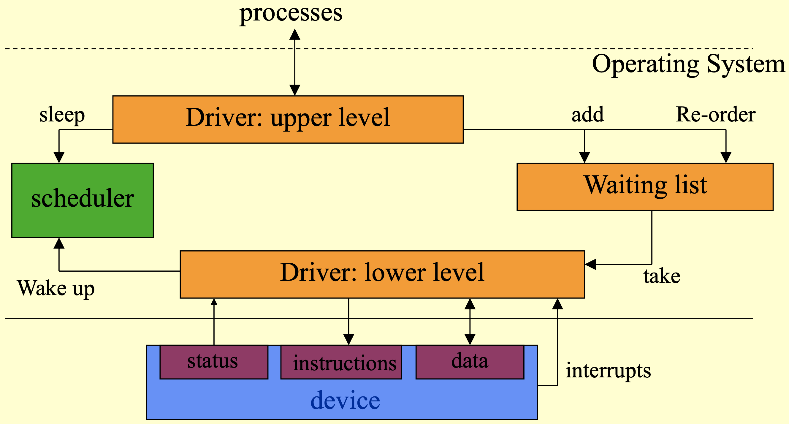

0. summary
1. what is it? 
	1. A sort of device driver that is able to suspend tasks if the device is busy.
2. what does it do? 
3. how does it work? 
	- upper level: accept requests
		- called by processes with requests
		- device free: request is passed directly
		- device busy: request is put in a waiting list
	- lower level: finish the request
		- starts after treating a previous request
		- is called by interrupt: interrupt-driven
		- may need to inform process that request is treated
		- possibly copies data to address space of process
		- waiting list is non empty: take next request, treat it. 
		- waiting list is empty: does nothing
4. where is it used?
	1. where it is important that all requests are handled
5. when is it used?
6. what are the potential problems? 
7. what are the pros and cons?
	1. pros: all requests are handled
	2. cons: requests may be handled after a delay and therefore data may become useless in hard RT systems. 
8. what are the possible alternatives?
	1. [[1 level device driver]]

