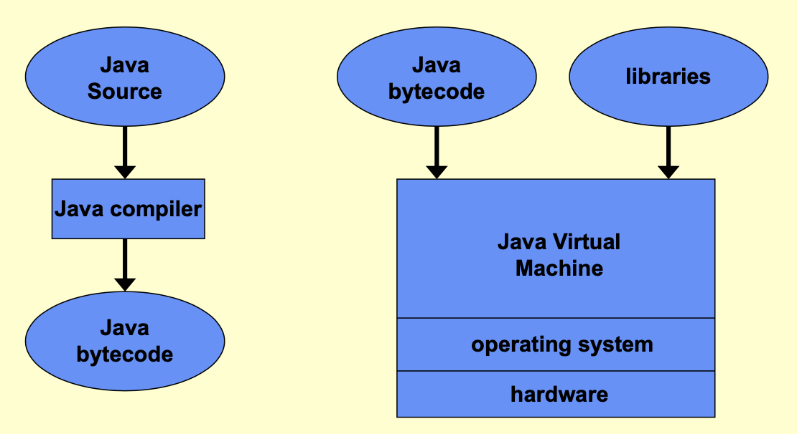

- Comparisons between [[RT systems]] and [[embedded systems]]. Examples. 
- Different types of RT systems: 
	- [[hard RT system]], [[soft RT system]] and [[firm RT systems]]. 
	- [[time-aware RT systems]] and [[reactive RT systems]]. 
	- [[time-triggered RT systems]] and [[event-triggered RT systems]]. 
- Examples of RT systems
	- RTS for process control
	- RTS in a production environment
	- [[RTS for communication command and control]]
	- industrial embedded computer systems
- [[characteristics of RT systems]]
- [[design methodology for RT system]]
- Programming language for RT system
	- [[requirements for RT programming languages]]
	- combined with [[general question 2]]
	- Java
		- [[Java class libraries]]
		- [[Java byte code]]
	- C/POSIX
		- [[POSIX]]

