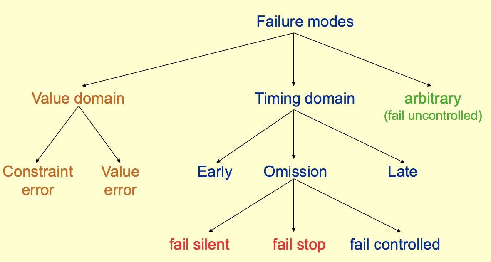

- failure, fault and error
	- fault -> error-> failure -> fault ... can be viewed recursively
	- failure: when a system does not behave as described in specification
	- error: internal problems of a failure, as an unauthorized internal state of the system
	- fault: origin of error, can be put fingers on
		- transient faults: faults occurs at a particular situation ,eg. fault in hardware caused by magnetic field
		- permanent faults:  faults occurs until it is restored, eg. software-design fault
		- intermittent faults:  transient faults that are regularly appears and disappears, eg. regularly overheated chip
- failure modes: [[fail stop]] and [[fail silent]]. 

- Two possible approaches for reliable systems
	- Fault prevention: avoid the occurrence before the system is put into operation
		- Fault avoidance
			- in hardware: packaging to avoid interference, reliable components
			- in software: specifications, design methods, languages, software environments
				- [[programming language comparison in fault prevention]]
		- Fault removal: design revision, program verification, code inspection, testing
		- Fault prevention alone is not enough. eg. hardware will eventually break down
	- Fault tolerance: capture faults while using the system so that the system continue to function
		- levels of fault tolerance
			- full fault tolerance, [[fail soft]] and [[fail safe]]
- Redundancy (for achieving fault tolerance)
	- Hardware redundancy
		- Static redundancy: N identical sub components
		- Dynamic redundancy: `checksum`
	- Software redundancy
		- Static redundancy: [[N-version programming]] (redundant and **independent** components always run)
		-  Dynamic redundancy: [[recovery blocks (dynamic software redundancy)]]
		-  [[comparison between N-version programming and recovery blocks]]