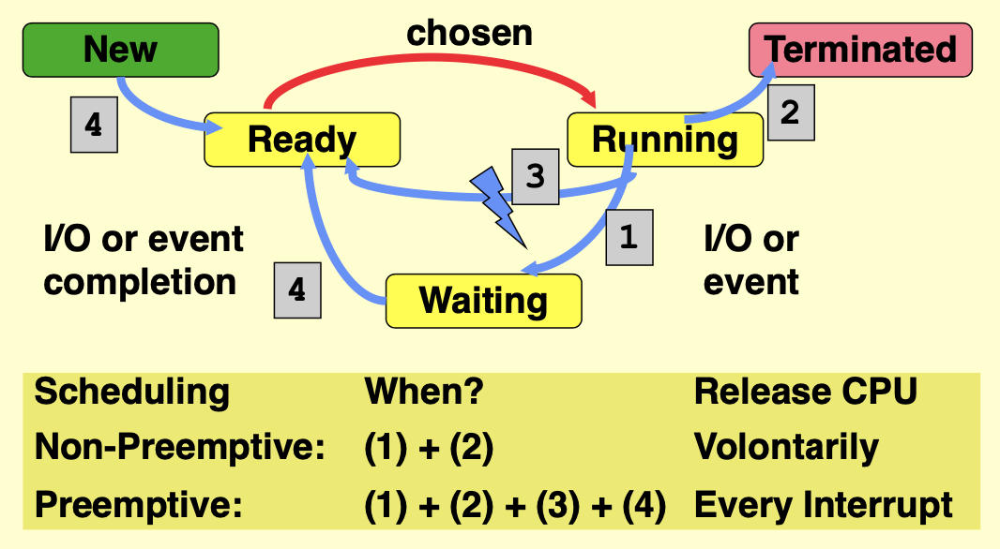

- when a process is ready, it waits for the scheduler to choose in running state. 
- When a process is in running state and want to do some IO, it goes into waiting
- all process in ready state are competing with each other to be chosen. 
- the scheduler use some algorithms to choose
- the scheduler can also place the process in running state directly to ready state
- preemptive: when an important process comes into the ready queue OR when an important process is in waiting state (blue arrow 4), the scheduler can stop a running process (blue arrow 3) and choose the new process into running state by interrupt. 