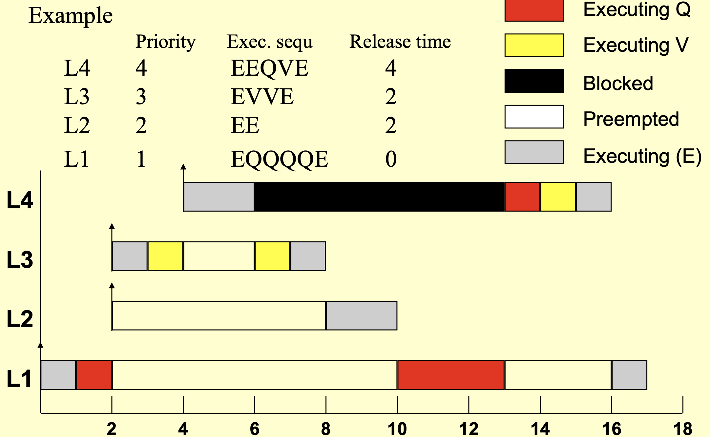
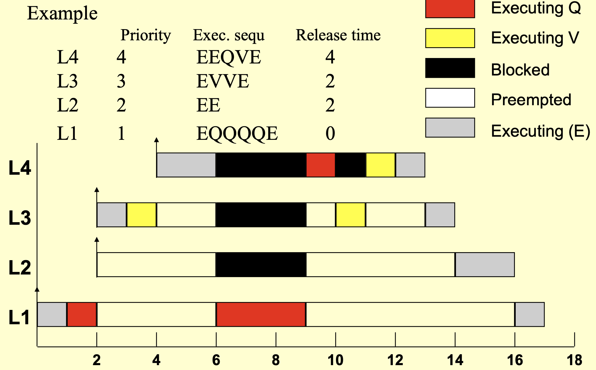

0. summary
1. what is it?
	1. Priority inheritance is the ability of a task to inherit the other tasks priority (it is also possible to inherit priority from a resource, this is used in priority ceiling protocols)
2. what does it do? 
	1. It causes a task to inherit priority from another task with a higher priority.
3. how does it work? 
	1. explained in the following two figures. 
	2. TODO
5. where is it used?
	1. in fixed priority scheduling and in earliest deadline first scheduling
6. when is it used?
	1. If there is a conflict in resource allocation between high and low priority tasks.
7. what are the potential problems? 
8. what are the pros and cons?
	1. pros: A higher priority task will finish quicker
	2. cons: It is hard to track which task is blocking which resource.
9. what are the possible alternatives?

simple task model is below.   

- 4 periodic tasks L1, L2, L3, L4  
- L4 has highest priority, L1 lowest  
- L4 and L1 share critical section, protected by semaphore Q 
- L4 and L3 share critical section, protected by semaphore V 
- E stands for execution during one time unit  
- Q and V stand for execution while holding Q or V

priority inheritance is below.  
