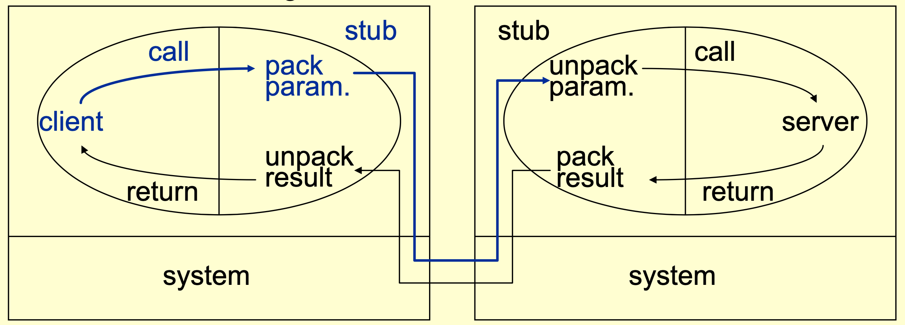

- mechanism offered by libraries
	- usually not supported by language
- provides the semantics of [[remote method invocation]]
- message is not really visible (implicit message), different from [[Rendez-vous in Ada]]
	- simple idea, ordinary parameters
	- better than explicit messages (send/receive)
		- low-level communication, programmers need to tackle details, thus error occurs
- problems RPC wants to solve
	- calling and called routines executes in different address space
	- machine difference
	- machine crash

---

- client call client stub
	- call client stub is ordinary procedure call
	- the client stub takes the parameters in a message
	- the client stub sends the message to the server
	- the client stub waits for the result
- server stub (part of server) receive the message
	- the server stub takes the parameters from the message
	- the server stub call the server procedure in the normal way
- server procedure gets control
	- act like the client is local
	- return the result to the server stub in the normal way
- server stub gets back the control
	- put the result in a message
	- send the message to the client stub
	- wait for a next message to come
- client stub receive the message
	- unwrap the message
	- make necessary copies for the client 
	- returns to the caller in the normal way
- the original caller get back the control
	- as if a return from local procedure call

---

- RPC is transparent
	- the caller does not need to know that the called procedure is running on another machine
	- the called procedure does not need to know that the caller is running on another machine
- client and server can be designed in a normal way, existing routines can be reused
- stubs can be generated by tools with description of interface

