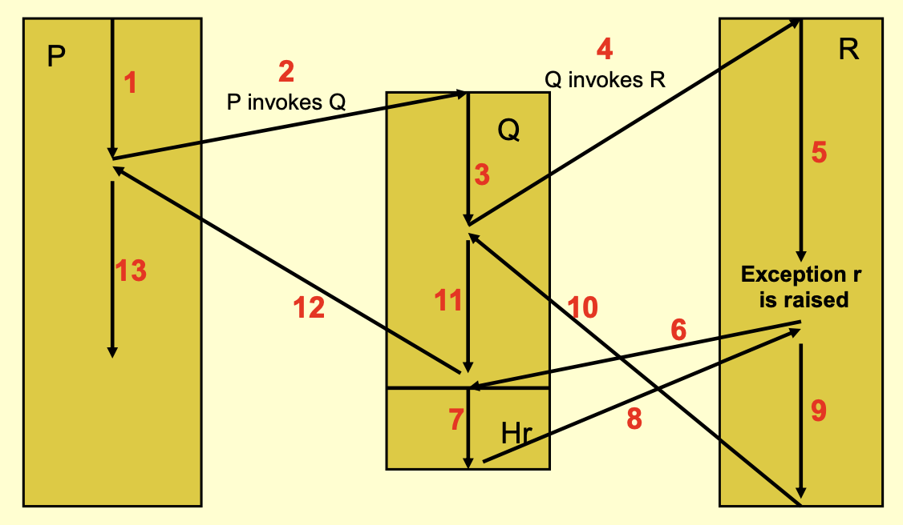

1. what is it, 
	1. One way to deal with [[exception propagation]] after the exception is handled. 
2. what does it do, 
3. how does it work, 
	1. The error handler of one program deals with the error occurred due to the call of this program
	2. the block of code is re-executed
4. where is it used, 
5. when is it used, 
	1. used in [[forward recovery]], sometimes [[backward recovery]] is also possible
6. what are the potential problems, 
7. what are the pros and cons, 
	1. pros: 
		1. When the error is caught during asynchronous events, this is an advantage. 
		2. good when dealing with [[asynchronous events]] (exceptions), see [[Chapter 07 Atomic actions, concurrent tasks and reliability]]
	2. cons: 
		1. 难以恢复由运行环境引发的错误。寄存器被写覆盖，丢数据，很像 [[backward recovery]]. Possible solution is re-execute the whole block where handler is associated with. 
		2. implementation is hard
8. what are the possible alternatives, etc.
	1. re-execution of the whole block where handler is associated with (eg. `Q` in the figure below, point `step[10].end` to `step[2].end`)
	2. [[termination model]]

