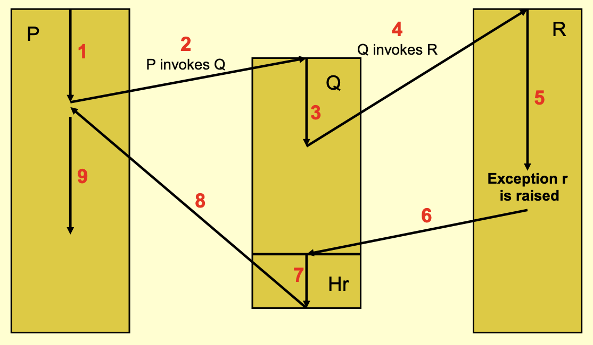

0. summary
1. what is it?
2. what does it do? 
	1. piece of program where error occurred is not resumed
	2. control goes to calling or enclosing block
	3. two ways (possibilities) of returning control
		1. normal: the exception is completely handled
		2. exception: the exception is passed on, or propagated
3. how does it work? 
4. where is it used?
	1. used in exception propagation in Ada or RTS Java
5. when is it used?
	1. used in [[forward recovery]], sometimes [[backward recovery]] is also possible
6. what are the potential problems? 
7. what are the pros and cons?
	1. pros
		1. structured approach
		2. supported by Ada and RTS Java, but not C (a source of error rather than solution)
8. what are the possible alternatives?
	1. [[resumption model]]

